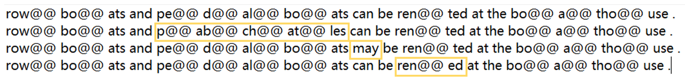
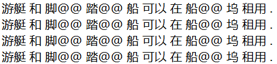
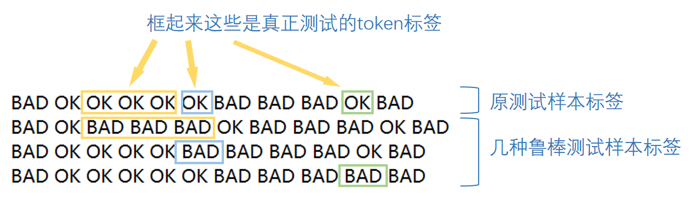
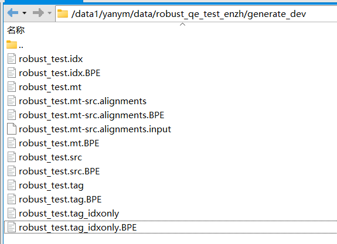

# QE 鲁棒性分析与改进

该项目对QE模型(DirectQE, TransQuest)的鲁棒性进行分析。

[数据集下载地址](https://huggingface.co/datasets/powerpuffpomelo/qe_data_yanym/tree/main)

[directqe分析的项目文档](https://gikt1e63yh.feishu.cn/docs/doccnjSH0vGp8DCe9xrR7Uy1vRe)


## 文件结构
- directqe_robustness (DirectQE模型的鲁棒性分析)
    - configs (配置文件)
    - scripts (运行脚本)
        - analysis (分析相关，包括梯度分析、影响函数、训练数据分析等)
        - contrastive_learning (对比学习)
        - train_directqe_* (训练脚本)
    - estimate_sentence.py (测试qe模型的句子级性能)
    - estimate_word.py (测试qe模型的词级别性能)

- TransQuest_robustness (TransQuest模型的鲁棒性分析)
    - mello_scripts (运行脚本)
        - analysis (梯度分析)
        - contrastive (对比训练)
        - normal (普通训练 + 标签预测)
        - robust (鲁棒性标签预测)

## QE鲁棒性测试集
### 测试集描述与展示
鲁棒性测试集：衡量QE模型在源端变化时做出正确预测的能力。

普通测试集的每条样本都可以衍生出一些鲁棒性测试样本：对于被标注为OK的mt token，修改其在源端的对齐token，并将该mt token的标签修改为BAD。

**一个例子如下**

原样本（bpe版本）：
> Src: row@@ bo@@ ats and pe@@ d@@ al@@ bo@@ ats can be ren@@ ted at the bo@@ a@@ tho@@ use .
> Mt: 游艇 和 脚@@ 踏@@ 船 可以 在 船@@ 坞 租用 .
> Gold tag: BAD OK OK OK OK OK BAD BAD BAD OK BAD

该样本衍生出了三条鲁棒性伪数据，分别修改了三处源端：



它们的mt都是一致的：



被修改源端的mt token，在原测试样本中标签为ok，修改后标签为bad：



### 文件说明

[鲁棒性测试集地址](https://huggingface.co/datasets/powerpuffpomelo/qe_data_yanym/tree/main/robust_test)



- robust_test.src: 测试集源语句
- robust_test.mt: 测试集翻译句
- robust_test.tag: 测试集翻译句的词标签
- robust_test.idx: 测试集翻译句中，真正用于测试鲁棒性的词汇索引（就是下图里框起来的标签所对应的索引，比如第2个框起来了，就是2，这里索引从0开始）
- robust_test.tag_idxonly: 索引所对应的词标签，鲁棒性看这部分标的怎么样就好啦（就是下图里框起来的标签）


### 生成鲁棒性测试集
从QE测试集生成鲁棒测试集
```
bash directqe_robustness/scripts/contrastive_learning/robust/generate_robust_testset_enzh.sh
```
生成鲁棒性测试集gold标签
```
python directqe_robustness/scripts/contrastive_learning/contrastive_pretrain/get_robust_gold_tag.py
```
测试鲁棒性
```
bash directqe_robustness/scripts/contrastive_learning/contrastive_pretrain/test_qe_robust.sh
```